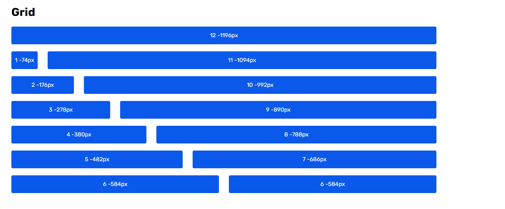

# Grid

```
/style.scss
@import "../projects/kit/src";
@import url('https://fonts.googleapis.com/css2?family=Rubik:wght@400;500;600;700&display=swap');


:root {
  @include air-grid(72px, 28px); // 72px = col width, 28px = col indent
}
```

```
//app.html
<div airGridItem="1"></div>
```




